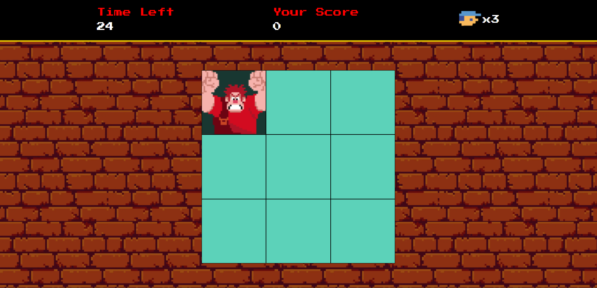

# Wreck it Ralph

Project developed at the Game Development Bootcamp.
It's a click speed game based on the movie Wreck-It Ralph.
The objective of the game is to click on the Ralph character as many times as possible before time runs out to increase your score.

To play, [click here](https://maripirczak.github.io/wreck-it-ralph/). 

   

## Technologies Used

- HTML5 and CSS3 for structuring the web page and styling the game interface.
- JavaScript to implement game logic and interactivity.
- Custom sprites and images to create the unique aesthetic of the Wreck-It Ralph universe.
